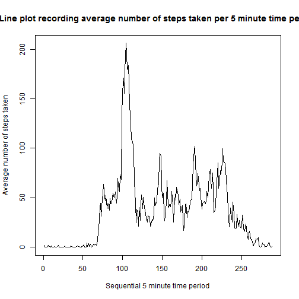
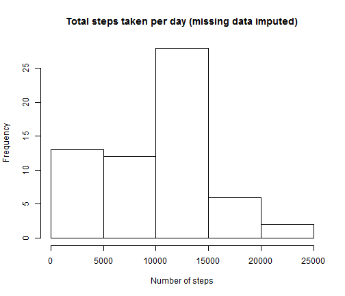
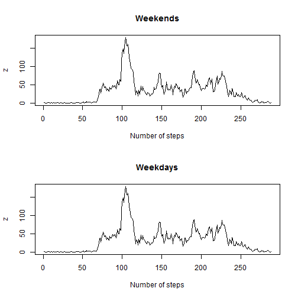

Title  Assignment for CG Tredoux- Reproducible Research, Assignment 1; May 2014
========================================================


This analysis concerns a dataset of fitness data, with a record of steps taken, the date they were taken,
and the interval between steps.

The original data can be found at https://d396qusza40orc.cloudfront.net/repdata%2Fdata%2Factivity.zip

In the present case, the data were read from a local file (see code immediately below).


```r
echo = T
fitdata <- read.csv("activity.csv", na.strings = "NA")  #Reads data from default directory
fitdata$date <- as.Date(fitdata$date)
```


We want to know what the distribution of the data look like, so we report a histogram 


* Histogram and central tendency of the total number of steps taken per day


```r

echo = T

a <- split(fitdata$steps, fitdata$date)
b <- sapply(a, sum, na.rm = T)

with(fitdata, hist(b, main = "Total steps taken per day", xlab = "Number of steps"))
```

 


The median and mean of the data set are reported below


```r
echo = T
with(fitdata, median(steps, na.rm = T))
```

```
## [1] 0
```

```r
with(fitdata, mean(steps, na.rm = T))
```

```
## [1] 37.38
```


The 5 minute interval steps are plotted, averaged across all days.  


```r
echo = T
c <- split(fitdata$steps, fitdata$interval)
z <- sapply(c, mean, na.rm = T)
plot(z, type = "l", xlab = "Sequential 5 minute time period", ylab = "Average number of steps taken", 
    main = "Line plot recording average number of steps taken per 5 minute time period")
```

 


The time interval with the highest average number of steps is computed. This is computed as interval 835, with average number of steps taken as 206.1698.


```r
echo = T
z[match(max(z), z)]
```

```
##   835 
## 206.2
```


We want to establish how many missing values there are in the dataset, and impute data in their place. 
The number of rows with at least one missing data point is 2304.


```r
echo = T
fitdata_missing <- fitdata[!complete.cases(fitdata), ]
length(fitdata_missing$steps)
```

```
## [1] 2304
```


We replace all missing values with the median of the variable they are missing from.  Since only "steps" has missing data, we only replace for this variable


```r
echo = T
fitdataI <- fitdata
fitdataI$steps <- replace(fitdataI$steps, is.na(fitdataI$steps), median(fitdataI$steps, 
    na.rm = T))
```


Now we compute the histogram for the number of steps taken, this time having imputed median values for
missing records.


```r

echo = T

a2 <- split(fitdataI$steps, fitdataI$date)
b2 <- sapply(a2, sum, na.rm = T)

with(fitdataI, hist(b2, main = "Total steps taken per day (missing data imputed)", 
    xlab = "Number of steps"))
```

 


We compare the mean and median total steps taken per day for the dataset without replacement of 
missing values, to those for the dataset with replacement.  We can see that the median does not change (0 in both 
instances, but the mean does - 37.38 in original, 32.48 once missing values are replaced with the median)


```r
echo = T
with(fitdata, median(fitdata$steps, na.rm = T))
```

```
## [1] 0
```

```r
with(fitdata, mean(fitdata$steps, na.rm = T))
```

```
## [1] 37.38
```

```r

with(fitdataI, median(fitdataI$steps, na.rm = T))
```

```
## [1] 0
```

```r
with(fitdataI, mean(fitdataI$steps, na.rm = T))
```

```
## [1] 32.48
```


We now break data down according to whether the steps were recorded on a weekday or a weekend day. To do this, we use the recode function from the car package.  


```r
echo = T
library("car")
zx <- weekdays(fitdataI$date)
fitdataI$dayofweek <- recode(zx, "c('Friday','Saturday','Sunday')='Weekend';\nelse='Weekday'")
```


```r


echo = T

c <- split(fitdataI$steps, fitdataI$interval, fitdataI$dayofweek)
z <- sapply(c, mean, na.rm = T)
par(mfrow = c(2, 1))

weekdayf <- subset(fitdataI, fitdataI$dayofweek == "Weekend", select = steps:dayofweek)
weekdayw <- subset(fitdataI, fitdataI$dayofweek == "Weekday", select = steps:dayofweek)

with(weekdayf, plot(z, type = "l", main = "Weekends", xlab = "Number of steps"))
with(weekdayw, plot(z, type = "l", , main = "Weekdays", xlab = "Number of steps"))
```

 

```r

```


